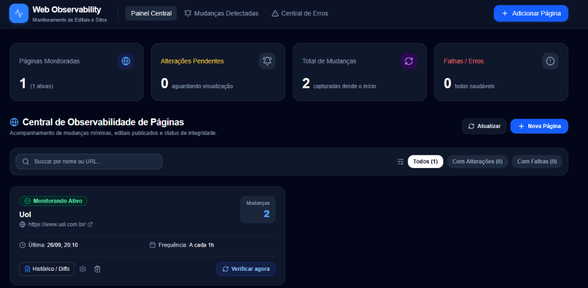
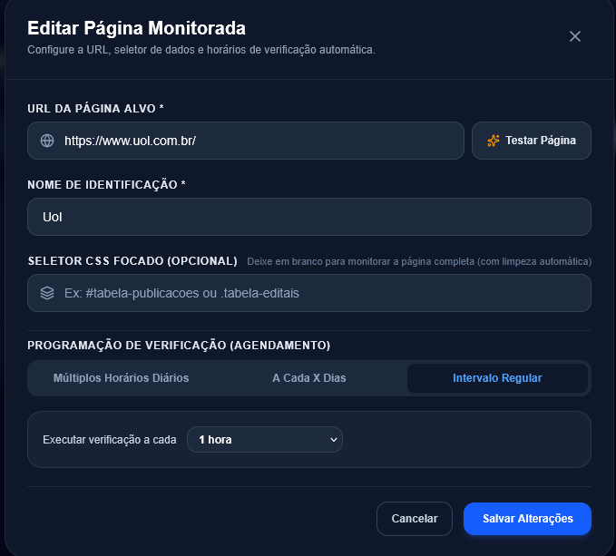
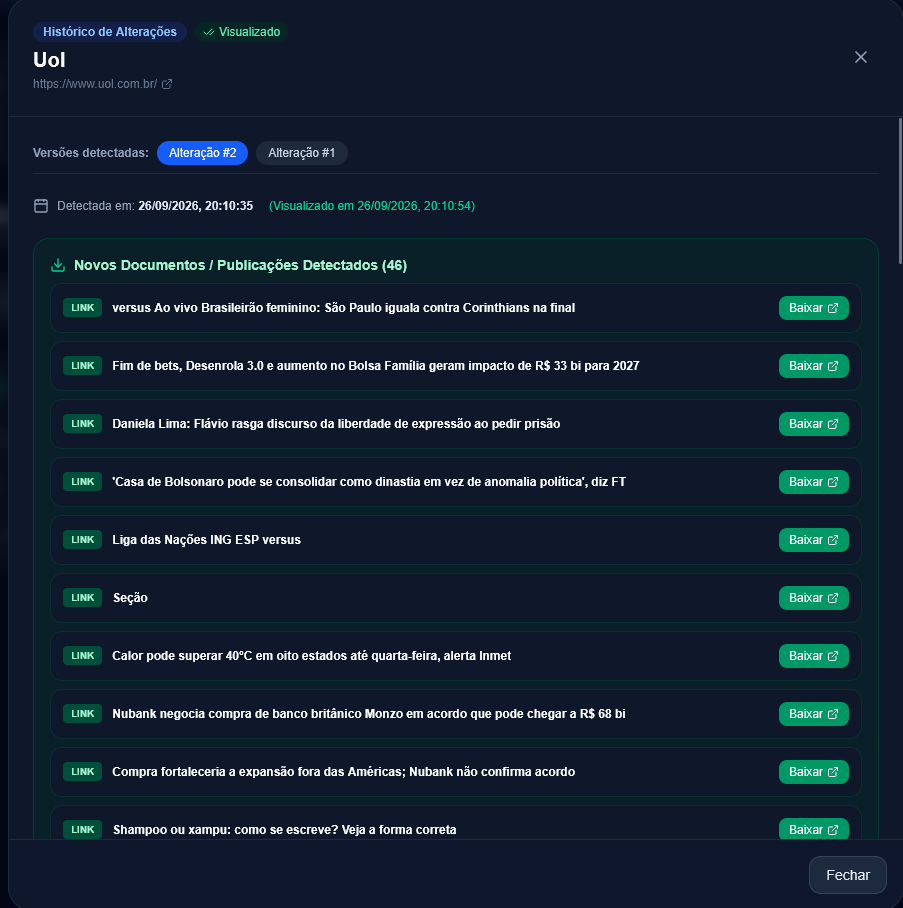

# Web Changes Observability 🔍

Plataforma moderna, autônoma e conteinerizada de observabilidade e monitoramento de páginas web, projetada especialmente para acompanhamento de **processos seletivos, concursos públicos e editais governamentais** onde as publicações são feitas diretamente em páginas estáticas ou ASP.NET sem notificações diretas por e-mail ou SMS.

> [!NOTE]
> 🚀 **Desenvolvido com Google Antigravity**:
> Este projeto foi concebido, arquitetado e implementado de ponta a ponta em pair programming com o **Google Antigravity** (plataforma avançada de engenharia com agentes de IA autônomos da Google DeepMind). O fluxo de desenvolvimento utilizou orquestração de sub-agentes especializados (`backend-agent`, `frontend-agent`, `devops-agent` e `qa-agent`), com divisão modular de responsabilidades, validações contínuas e testes de integração automatizados.

---

## 📸 Demonstração / Screenshots

### 1. Painel Central de Observabilidade
Visualização em tempo real de páginas monitoradas, contadores de mudanças desde a adição, status de integridade e acesso rápido a verificações imediatas.



---

### 2. Configuração de Agendamento Flexível
Permite agendar verificações por intervalos regulares (ex: a cada 1h), a cada X dias em horário fixo, ou em múltiplos horários diários (ex: 08:00, 12:00, 16:00, 20:00).



---

### 3. Visualizador de Diffs & Detecção de Documentos Anexos
Histórico de alterações com detecção automática de novos arquivos (`.pdf`, `.docx`, links de publicação) com botão de download direto e controle de visualização confirmada ("Confirmar Visualização").



---

## 🌟 Principais Recursos

- **Coleta Inteligente com Sanitização de Ruídos**:
  - Filtra automaticamente tokens dinâmicos de portais legados (ex: `__VIEWSTATE`, `__EVENTVALIDATION`, scripts analíticos de portais ASP.NET e governamentais).
  - Evita **100% dos falsos alarmes** de alteração de página.
- **Rastreamento de Editais e Documentos Anexos**:
  - Detecta automaticamente a inclusão ou remoção de arquivos `.pdf`, `.docx`, `.doc`, `.xlsx` e editais.
  - Disponibiliza botões de download direto para as novas publicações encontradas.
- **Notificações Instantâneas via Telegram Bot (BotFather)**:
  - Disparo automático de alertas no Telegram para usuários, grupos ou canais sempre que uma alteração ocorrer.
  - Mensagens ricas contendo resumo das linhas alteradas e links diretos para download de novos documentos e editais.
  - Detecção com 1 clique de `chat_id` via `getUpdates` e teste de envio de notificação em tempo real.
  - Menu e painel dedicado no Dashboard (`/telegram`) com guia passo a passo do `@BotFather`.
- **Central de Alertas com Seção de Destaque**:

  - Painel com seção dedicada no topo para páginas que sofreram alterações recentes.
  - Ação de **"Confirmar Visualização / Marcar como Visto"** para atestar ciência e limpar o alerta.
- **Histórico Completo & Visualizador de Diffs**:
  - Linhas adicionadas em destaque verde (+) e removidas em vermelho (-).
  - Contador de quantas mudanças ocorreram desde o momento em que a página foi cadastrada.
- **Agendamento Flexível**:
  - **Múltiplos horários diários** (ex: 4 vezes ao dia às *08:00, 12:00, 16:00 e 20:00*).
  - **Periodicidade em dias com horário fixo** (ex: *1 vez a cada 3 dias às 09:00*).
  - **Intervalos regulares** (ex: *a cada 1h, 4h ou 6h*).
- **Central de Falhas e Erros de Observabilidade**:
  - Indicador visual e aba dedicada para páginas que apresentaram erro (timeouts, quedas de conexão, HTTP 403/500).
  - Botão de retry manual imediato.
- **Pronto para Docker & VPS / Coolify**:
  - Multi-container orquestrado com persistência SQLite em volume (`/data/observability.db`).

---

## 🏗️ Arquitetura e Engenharia com Google Antigravity

O projeto foi planejado e construído através do modelo de sub-agentes do **Google Antigravity**:

- **`backend-agent` (Python / FastAPI / SQLite / APScheduler)**:
  - Baseado no [FastAPI Tutorial](https://fastapi.tiangolo.com/tutorial/).
  - Motor assíncrono de observabilidade com `httpx`, `BeautifulSoup4` e `difflib`.
  - Persistência assíncrona SQLite com `SQLAlchemy` e `aiosqlite`.
  - Agendador assíncrono flexível com `APScheduler`.
- **`frontend-agent` (Next.js 15 App Router / Tailwind CSS / Lucide)**:
  - Baseado nas diretrizes [Next.js AI Agents](https://nextjs.org/docs/app/guides/ai-agents) com arquivo `AGENTS.md`.
  - Dashboard interativo, modais de diff, teste de URL em tempo real e formulários de agendamento.
- **`devops-agent` (Docker / Docker Compose / Coolify)**:
  - `Dockerfile` multi-stage com `output: "standalone"` para Next.js e imagem slim para FastAPI.
  - Orquestração via `docker-compose.yml` com healthcheck e volumes persistentes.
- **`qa-agent` (Validação E2E)**:
  - Testes automatizados cobrindo requisições, limpeza de formulários dinâmicos, comparativo de diffs e extração de documentos.

---

## 🚀 Como Executar

### Opção 1: Via Docker Compose (Recomendado)

Clone o repositório e execute:

```bash
docker compose up --build -d
```

- **Front-end**: acesse [http://localhost:3000](http://localhost:3000)
- **API Back-end & Swagger Docs**: acesse [http://localhost:8000/docs](http://localhost:8000/docs)
- **Persistência**: os dados do SQLite e histórico de snapshots ficam salvos com segurança no volume nomeado `observability_sqlite_data`.

---

### Opção 2: Deploy no Coolify (VPS)

1. No painel do seu **Coolify**, crie um novo **Service** ou **Application**.
2. Selecione **Docker Compose** e conecte seu repositório Git (`web-changes-observability`).
3. O Coolify detectará automaticamente o arquivo `docker-compose.yml`.
4. Defina o domínio público desejado para o serviço `frontend` (ex: `https://monitor.seudominio.com`).
5. Nas variáveis de ambiente do Coolify, defina se necessário:
   ```env
   NEXT_PUBLIC_API_URL=https://api-monitor.seudominio.com/api
   ```
   *(ou aponte diretamente através do proxy reverso interno do Coolify)*.
6. Clique em **Deploy**. O volume `observability_sqlite_data` persistirá todos os dados automaticamente mesmo após atualizações de versão.

---

### Opção 3: Execução Local para Desenvolvimento

#### 1. Iniciar o Back-end (FastAPI):
```bash
cd backend
python -m venv venv
# Windows:
.\venv\Scripts\activate
# Linux/Mac:
# source venv/bin/activate

pip install -r requirements.txt
uvicorn app.main:app --reload --port 8000
```

#### 2. Iniciar o Front-end (Next.js):
```bash
cd frontend
npm install
npm run dev
```

Acesse [http://localhost:3000](http://localhost:3000).

---

## 📌 Como Usar

Ao cadastrar qualquer página para observabilidade:
1. Informe a URL desejada (e opcionalmente um seletor CSS se quiser restringir a uma tabela ou div).
2. Clique em **"Testar Página"** para validar se o site responde e inspecionar os primeiros links/textos identificados.
3. Escolha o agendamento desejado (múltiplos horários diários, dias fixos ou intervalos regulares).
4. A aplicação monitorará continuamente em segundo plano.
5. Assim que houver qualquer alteração mínima (novo texto, novo edital em PDF ou convocação), um alerta visual de destaque será exibido no topo do painel, permitindo comparar o que mudou e confirmar a visualização.

---

## 📄 Licença
Distribuído sob a licença MIT. Veja `LICENSE` para mais detalhes.
